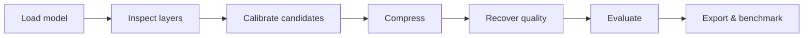

# TN Compression

**Find out how small a PyTorch model can become before its quality stops being acceptable.**

TN Compression is an experiment toolkit for replacing large neural-network weights with compact tensor factors, then measuring what actually changed: task quality, model size, memory, latency, and throughput. It supports vision models and causal language models through the same reproducible workflow.

Tensor decomposition is simple in spirit, the difficult part is choosing **which layers to transform and how aggressively**. This project treats that choice as a measured engineering decision—not a compression-ratio contest.

> A smaller parameter count is not automatically a faster model. TN Compression keeps storage, quality, and runtime measurements separate so the result reflects the deployment you will actually use.

## The workflow



One configuration records the model, dataset, task, seed, compression policy, and benchmark setup. Each stage emits machine-readable results, while checkpoint bundles preserve both the transformed weights and the exact recipe needed to reconstruct them.

The result is an auditable answer to a practical question:

> Which transformation gives this model the best quality–size–latency trade-off on this task, hardware, and runtime?

## Why this project is useful

- **Evidence before claims.** The workflow can screen candidate layers locally, test them in the real model, and validate the combined result on the task.
- **More than one compression strategy.** Compare tensor decompositions, low-rank approximations, quantization, and structured pruning without rebuilding the experiment around each method.
- **Portable experiments.** Bundles contain model provenance, resolved ranks or factors, preprocessing metadata, checksums, and transformation details.
- **Honest deployment measurements.** Benchmarks run in isolated processes and report artifact bytes, memory, latency distributions, and throughput. Unsupported or slower configurations remain visible.
- **Bring your own model.** Use TorchVision, Segmentation Models PyTorch, Hugging Face Transformers, PyTorch Hub, or a custom `nn.Module` factory.

## Quickstart

Python 3.11 is the reference environment; Python 3.9+ is supported.

```bash
python -m venv .venv
source .venv/bin/activate
pip install -e ".[vision,test]"
```

Run a complete offline segmentation experiment on synthetic data:

```bash
# 1. Train a tiny baseline
tn-compress train \
  --config examples/configs/segmentation-synthetic.yaml \
  --output-dir runs/demo/train

# 2. See which layers can be transformed
tn-compress inspect \
  --config examples/configs/segmentation-synthetic.yaml \
  --checkpoint runs/demo/train/bundle \
  --output-dir runs/demo/inspect

# 3. Apply the configured decomposition
tn-compress compress \
  --config examples/configs/segmentation-synthetic.yaml \
  --checkpoint runs/demo/train/bundle \
  --output-dir runs/demo/compressed

# 4. Measure the quality of the compressed model
tn-compress evaluate \
  --config examples/configs/segmentation-synthetic.yaml \
  --checkpoint runs/demo/compressed/bundle \
  --output-dir runs/demo/evaluate
```

This example is deliberately small and offline: it proves the lifecycle, not real-world model quality. Continue with fine-tuning, ONNX export, and isolated benchmarking using the commands in the [workflow guide](docs/workflows.md).

## What can be compressed?

| Approach | Best suited to | Available implementations |
| --- | --- | --- |
| Tensor decomposition | Convolutional and dense weights with exploitable tensor structure | Tensor Train / TTPWT, Partial Tucker, CP3, CP4 |
| Low-rank approximation | Linear layers and projections | SVD, activation-weighted SVD |
| Quantization | Language-model linear weights | Dense round-to-nearest reference, maintained GPTQ W4A16 example |
| Structured pruning | Compatible gated MLP blocks | Coupled channel removal across gate/up/down projections |

Every method declares the module types, layouts, dtypes, and runtimes it supports. Fused kernels, tied weights, grouped convolutions, custom forwards, and unusual layouts need an adapter; the inspector reports these cases instead of silently changing them.

### Models, tasks, and runtimes

| Area | Current scope |
| --- | --- |
| Model sources | TorchVision, Segmentation Models PyTorch, Hugging Face Transformers, PyTorch Hub, custom factories |
| Tasks | Classification, semantic segmentation, object detection, causal language modeling |
| Quality metrics | Accuracy, IoU, Dice, COCO-style AP, loss, NLL, perplexity, teacher-model KL |
| Execution | PyTorch CPU/CUDA, ONNX Runtime for supported vision paths, experimental vLLM serving path |
| Measurements | Parameters, serialized bytes, CPU RSS, CUDA memory, latency distributions, throughput, TTFT, inter-token latency |

The benchmark models are stable fixtures, not an allowlist. A model is supported when it satisfies the selected model × method × task × backend contract.

## How a compression decision is made

1. **Inspect.** Discover eligible, protected, and unsupported modules before touching the model.
2. **Screen locally.** Estimate reconstruction damage from bounded calibration data—for example, the change in a linear layer's output under representative activations.
3. **Intervene.** Materialize each promising candidate and measure its effect on the full task, not just its weight error.
4. **Allocate a budget.** For language-model ranks, select candidates against a tensor-byte target while enforcing an NLL constraint.
5. **Validate cumulatively.** Re-evaluate the combined model, reject regressions, then save the accepted transformation as a self-describing bundle.

CKA, gradients, and reconstruction error are useful diagnostics, but none is presented as a substitute for end-to-end evaluation.

## Configuration at a glance

Compression policies can target one layer, groups of layers, or all compatible layers. This example replaces one convolution with a rank-8 Partial Tucker factorization:

```yaml
seed: 0
task: segmentation

model:
  source: smp
  name: Unet
  weights: null
  kwargs:
    encoder_name: resnet18
    classes: 3

compression:
  mode: individual
  layers:
    encoder.layer1.0.conv1:
      type: partial_tucker
      rank: 8
```

Start from the runnable configurations in [`examples/configs`](examples/configs). For a private or research model, provide an importable factory plus a task contract; the compression implementations do not need to know the model's brand or architecture name.

## Outputs you can trust and reuse

A standard run produces JSON results and a checkpoint bundle containing:

- the model source, constructor arguments, and pinned revisions;
- tensor-only weights with a SHA-256 checksum;
- resolved replacement structures and transformation history;
- run metadata, including the workflow configuration used by the CLI.

The bundle reconstructs a supported compressed model directly—without rerunning decomposition. Backend-specific exports, such as the GPTQ example, use their native checkpoint format and record separate provenance.

Benchmark reports distinguish loading from steady-state inference, synchronize CUDA measurements, and record warmup and repetitions. ONNX export verifies output parity against PyTorch.

## Repository map

```text
tn_compression/          Public API, CLI, decompositions, tasks, checkpoints, benchmarks
compression/             Compatibility workflows and representation-analysis utilities
examples/configs/        Runnable vision, language, pruning, and serving experiments
tests/                   Numerical, lifecycle, parity, and contract regression tests
docs/                    Workflows, evidence, serving notes, and provenance
containers/              Research and serving environments
```

## Read next

- [Runnable workflows](docs/workflows.md) — the full train → compress → recover → evaluate → export → benchmark lifecycle
- [Language experiments](docs/language.md) — calibrated low-rank, pruning, quantization, and Qwen pilot details
- [Serving and quantization](docs/serving.md) — backend compatibility and measurement protocol
- [Implementation evidence](docs/implementation-log.md) — milestone validation and recorded results
- [Provenance](docs/provenance.md) — source attribution and implementation lineage

## Scope

This is a research and engineering toolkit, not a promise that every smaller model will be faster or equally accurate. Synthetic fixtures validate mechanics; public-data and hardware-specific claims require their own recorded runs. Compression also does not establish model safety or alignment.

Contributions should include a capability contract, focused tests, a reproducible configuration, and measured evidence for performance claims.

Licensed under the [MIT License](LICENSE).