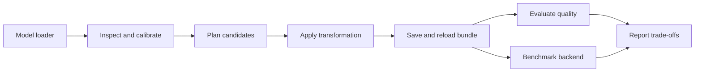

# TN Compression

A model-agnostic (within declared capability contracts) compression and inference evaluation toolkit for PyTorch vision models and Hugging Face causal language models.

TN Compression turns a trained model into a reproducible engineering artifact:

1. construct and inspect a model;
2. collect bounded calibration data;
3. score candidate transformations;
4. apply tensor decomposition, quantization, low-rank approximation, or structured pruning;
5. fine-tune when requested;
6. save a self-describing checkpoint bundle;
7. validate quality and measure real deployment cost.

The project is designed to answer a practical research question: **which transformation gives the best quality–size–latency trade-off for this model, task, hardware target, and serving backend?**

## What the project provides

- A single Python API and `tn-compress` CLI for inspection, damage-aware analysis, compression, training, fine-tuning, evaluation, export, and benchmarking.
- Explicit capability checks for model × method × task × backend combinations.
- One lifecycle for vision and language models, with task-specific evaluators.
- Portable checkpoint bundles that preserve the exact resolved transformation.
- Isolated-process measurements for parameters, artifact bytes, memory, latency, and throughput.
- Reproducible configurations, seeds, raw results, plots, and provenance.

The toolkit is intentionally open to user-supplied models. The benchmark models are small, stable fixtures; they are examples for comparison, not an allowlist.

## Architecture



The layers are separate:

| Layer | Responsibility |
| --- | --- |
| Model loaders | Build a model from TorchVision, SMP, PyTorch Hub, Transformers, or a custom factory. |
| Task adapters | Define inputs, targets, outputs, losses, and metrics for classification, segmentation, detection, and causal language modeling. |
| Compression methods | Implement decompositions, low-rank transforms, quantization, and structured pruning with explicit module support. |
| Calibration and allocation | Collect bounded data, estimate local damage, enforce budgets, and choose candidates. |
| Checkpoints | Serialize weights plus the construction recipe and resolved transformation metadata. |
| Runtimes | Execute PyTorch, ONNX Runtime, and supported vLLM paths; optional SGLang/TensorRT integrations remain backend-specific. |
| Reporting | Produce machine-readable results and human-readable comparisons without hiding failed or slower configurations. |

## Supported model inputs

Use a model identifier, a local constructor, or an importable factory. The loader records the source and revision so an experiment can be recreated.

| Source | Typical input | Notes |
| --- | --- | --- |
| TorchVision | Model name and explicit weights | Classification and detection models from the TorchVision registry. See the [TorchVision model docs](https://docs.pytorch.org/vision/stable/models.html). |
| Segmentation Models PyTorch | Architecture, encoder, weights, and decoder settings | SMP classification, segmentation, and encoder–decoder models. See the [SMP model docs](https://smp.readthedocs.io/en/latest/models.html). |
| PyTorch Hub | Repository, entrypoint, and pinned ref or local cache | Hub models are arbitrary PyTorch modules; the loader preserves the source information. See the [PyTorch Hub docs](https://docs.pytorch.org/docs/2.14/hub.html). |
| Hugging Face Transformers | Model id or local path plus pinned revision | Causal language models through `AutoModelForCausalLM`; tokenizer and revision are part of the bundle. See the [Transformers Auto docs](https://huggingface.co/docs/transformers/model_doc/auto). |
| Custom | Import path to a factory and serialized constructor arguments | Use this for private, research, or application-specific `nn.Module` implementations. |

“Any model” means any model that satisfies the selected contract, not that every method can safely rewrite every module. Ordinary `Conv2d` and `Linear` paths are generic. Functional layers, fused kernels, tied weights, grouped/depthwise convolutions, custom attention, and unusual tensor layouts require a registered handler or explicit protection. Unsupported modules are reported and left unchanged; they are never silently approximated.

## Tasks and evaluation

### Classification

Accepts image tensors and label targets. Reports loss, top-1/top-k accuracy, parameter count, artifact size, and latency distributions.

### Semantic segmentation

Supports binary and multiclass masks, including Oxford-IIIT Pet trimaps. Reports mean IoU, per-class IoU, Dice, loss, and the contribution of protected stem/head layers to total size.

### Object detection

Supports models with variable-size image lists and structured outputs (boxes, labels, and scores). Reports validation loss where available and COCO-style AP/AP50 on a declared dataset or fixture. Detection handlers preserve post-processing and output contracts.

### Causal language modeling

Uses tokenized text with attention and label masks. Reports token-level negative log-likelihood, perplexity, teacher-model KL divergence, and optional downstream task scores. Calibration and evaluation datasets, tokenizer revisions, sequence lengths, and masks are recorded.

## Compression methods

Each method declares the module types, tensor layouts, dtypes, and runtimes it supports.

| Method | Primary scope | Engineering note |
| --- | --- | --- |
| Tensor Train / TTPWT | `Conv2d` and `Linear` | Factorized execution with device, dtype, stride, padding, bias, and rectangular-kernel checks. |
| Partial Tucker | `Conv2d` | Decomposes selected channel modes while preserving protected layers and external shapes. |
| CP (CP3/CP4) | Selected convolutional layers | Experimental variants remain explicitly named and validated against their documented execution. |
| SVD / weighted SVD | `Linear` and compatible projections | Dense low-rank replacement with optional activation-weighted error. |
| Activation-aware low rank | Calibrated linear projections | Uses input statistics to screen candidates; claims are separated from the underlying SVD implementation. |
| Quantization | Linear and convolutional weights, as supported | Includes a reference round-to-nearest path and deployable GPTQ/AWQ integrations where the backend supports them. Packed storage and kernel speedups are measured, not assumed. |
| Structured pruning | Gated MLP blocks | Physically removes compatible intermediate channels across gate/up/down projections. Widths, indices, and architecture handlers are recorded. |
| Wanda / SparseGPT baselines | Language-model weight sparsity | Optional comparison methods; zero counts are not presented as speedups without a sparse runtime measurement. |

The public API keeps method implementations reusable while task workflows, reports, and CLI presentation stay separate.

## How compression decisions are made

CKA and raw gradient diagnostics are available as descriptive analyses, but they are not used as stand-alone damage predictors. A candidate transformation follows this policy:

1. **Local screening.** On bounded calibration batches, compare the original and candidate module outputs. For a linear module, the default score is an activation-weighted reconstruction estimate such as `E_local = mean(||(W - W_hat) X||_2^2)`, with layer dimensions and calibration statistics recorded.
2. **Actual intervention.** Materialize the candidate in a copy of the model and measure task loss, output KL, or the task metric (IoU, AP, accuracy, or language-model NLL).
3. **Budget allocation.** Select candidates against an explicit parameter/byte/latency budget using measured marginal damage. Protected layers and unsupported modules are constraints.
4. **Cumulative validation.** Re-evaluate the complete transformed model after each accepted group. Roll back candidates that violate the quality constraint or fail runtime validation.
5. **Final report.** Publish local scores alongside actual quality deltas and resource measurements so correlations can be inspected rather than assumed.

This makes the diagnostics useful for directing work while keeping the claim tied to end-to-end evidence.

## Checkpoint bundles and portability

A bundle contains:

- model family, source, constructor arguments, and pinned revisions;
- weights and checksums;
- resolved decomposition factors/ranks, pruning indices, or quantization scales;
- preprocessing, tokenizer, class mappings, and output schema;
- calibration and training settings, seeds, and fine-tuning policy;
- the transformation graph and package version.

Reloading a bundle reconstructs the resolved model directly; it does not rerun rank selection or decomposition. A custom model is portable when its factory and output contract are available. Full-module loading remains supported for legacy checkpoints, but new experiments should use bundles.

Fine-tuning policies support the full model, decoder/head-only, or explicit parameter selections. The optimizer is created after compression and freezing so that only intended parameters are updated.

## Quickstart

Python 3.11 is the reference environment (the package declares Python 3.9 or newer).

Install the core package and test dependencies:

```bash
python -m venv .venv
source .venv/bin/activate
pip install -e ".[test]"
```

Install optional extras only for the workflow you need:

```bash
pip install -e ".[vision]"       # TorchVision/SMP workflows
pip install -e ".[language]"     # Transformers and language evaluation
pip install -e ".[deployment]"  # ONNX Runtime and deployment measurements
```

Run an offline synthetic lifecycle:

```bash
tn-compress analyze --config examples/configs/analyzer-smoke.yaml --output-dir runs/demo/analysis --level validated --device cpu
tn-compress compress --config examples/configs/analyzer-smoke.yaml --plan runs/demo/analysis/compression_plan.json --output-dir runs/demo/compressed --device cpu
tn-compress evaluate --checkpoint runs/demo/compressed/bundle --config examples/configs/analyzer-smoke.yaml --output-dir runs/demo/evaluate --role test --device cpu
```

See [the damage-aware analyzer design](docs/design/damage-aware-analyzer.md) for
the evidence levels, configuration schema, plan format, offline asset preparation
and the resumable experiment runner.

For a user-supplied model, provide a loader specification and task contract in YAML, then run `inspect` before selecting a method. The inspector reports supported and protected modules, tensor shapes, parameter counts, and reasons a transformation is unavailable.

Language experiments use the same lifecycle. A typical configuration pins a Hugging Face model revision, tokenizer, calibration text, sequence length, candidate projection, quantization/pruning method, and evaluation budget. vLLM serving is enabled only for representations and quantization formats it can load; custom factorized or structurally pruned models use a project runtime adapter until a native backend exists.

## Benchmark protocol

The benchmark suite is deliberately small enough for CI and reproducible research, while the API accepts larger user models.

Vision fixtures include:

- U-Net/ResNet34, FPN/ResNet18, and U-Net/MobileNetV2 on Oxford-IIIT Pet segmentation;
- small TorchVision classification and detection models for contract tests and comparison;
- synthetic offline data for fast lifecycle tests.

Language fixtures use pinned small causal language models, with a Qwen-family pilot as one reproducible example. They compare weighted low rank, quantization, structured gated-MLP pruning, and sparsity baselines where the model and runtime support them.

Every study records:

- model/data/code revisions, split identifiers, seeds, precision, and configuration;
- mean and spread across seeds;
- parameters, serialized bytes, CPU RSS, CUDA allocated/reserved memory;
- latency distributions, throughput, time-to-first-token, and time-per-output-token where applicable;
- PyTorch CPU/CUDA results and ONNX Runtime CPU results for vision;
- vLLM results only for compatible language representations and quantization formats.

Measurements run in isolated processes with declared hardware, thread counts, warmup, repetitions, and CUDA synchronization. Model loading is reported separately from steady-state inference. ONNX outputs are checked against PyTorch before runtime numbers are published. Failed configurations and regressions remain in the raw results.

## Repository guide

```text
tn_compression/              # reusable public Python package
  api.py                     # inspect, plan, apply, and compress entry points
  models.py                  # configurable model construction and provenance
  config.py                  # YAML configuration loading and validation
  artifacts.py               # device and artifact utilities
  decompositions/            # TT/TTPWT, Tucker, CP, and low-rank implementations
  pruning.py                 # structured language-model pruning
  quantization.py            # reference and backend-aware quantization
  calibration.py             # bounded data collection and local error scores
  allocation.py              # resource-aware candidate selection
  checkpoints.py             # portable checkpoint bundles
  tasks/                     # vision, detection, language, and recovery contracts
  benchmark.py                # isolated PyTorch measurements
  export.py                  # ONNX export and parity helpers
  language_experiments.py    # language candidate evaluation and pilots
  serving.py                 # streaming clients and serving metrics
compression/                 # workflow and report helpers retained for compatibility
examples/configs/            # synthetic, vision, language, and serving configurations
tests/                       # numerical, lifecycle, parity, and contract regression tests
docs/                        # workflows, language, serving, provenance, and design notes
containers/                  # research and serving Docker images
```

Start with [docs/workflows.md](docs/workflows.md) for the end-to-end lifecycle, then read [docs/language.md](docs/language.md) for causal-LM experiments and [docs/serving.md](docs/serving.md) for runtime measurements. [docs/provenance.md](docs/provenance.md) explains inherited code, integrations, fixes, and experiment ownership.

## Reproducibility, safety, and scope

- CI is CPU-only, offline, and uses small fixtures. GPU, ONNX, and serving studies run as separate jobs with their environment recorded.
- Compression is not a safety guarantee. The toolkit can compare output drift, calibration behavior, and selected robustness checks, but it does not establish alignment or model safety.
- Safety-oriented evaluation should be a separate project or an explicitly scoped extension (for example, agent reliability and oversight experiments) with its own threat model and benchmarks.
- Established algorithms are attributed to their original publications and upstream projects. Integration code, fixes, tests, and measurements are identified separately.
- Contributions should add a capability contract, focused regression tests, a reproducible configuration, and measured evidence for any performance claim.
